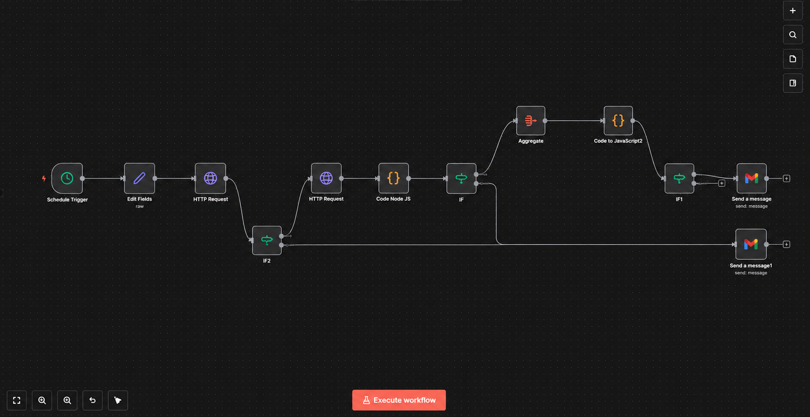

# Automated API Integration Monitoring System

An automated monitoring solution built with **n8n** to detect API schema changes, validate integration health, and identify potential compatibility issues across security tool integrations.

---

## Overview

Modern security platforms rely on multiple API integrations to exchange data and maintain operational visibility. However, changes to API response structures can introduce compatibility issues, disrupt data flows, and compromise the reliability of connected systems.

This project addresses that challenge through an automated API monitoring workflow that periodically retrieves API responses, compares their structure against predefined baseline schemas, and identifies changes that may affect integration stability.

The system classifies integration health based on validation results and generates notifications when potential issues are detected, reducing the need for repetitive manual checks.

## Key Features

- **Automated API Monitoring:** Periodically retrieves API responses using scheduled workflows.
- **Schema Validation:** Compares live API response structures against predefined baseline schemas.
- **Change Detection:** Identifies missing fields, newly introduced fields, and data type inconsistencies.
- **Integration Health Assessment:** Classifies integration status as `HEALTHY`, `DEGRADED`, or `BROKEN` based on configured validation rules.
- **Automated Notifications:** Alerts relevant stakeholders when schema changes or potential integration failures are detected.
- **Workflow Orchestration:** Coordinates API requests, data processing, validation, and notifications through n8n.

## System Architecture

The monitoring workflow follows a structured sequence of operations:

1. **Scheduled Trigger:** Initiates monitoring at predefined intervals.
2. **API Request:** Retrieves the latest response from the configured security tool API.
3. **Data Processing:** Extracts and prepares the response data for validation.
4. **Schema Comparison:** Compares the live response against the predefined baseline schema.
5. **Validation and Classification:** Evaluates detected changes and determines the integration health status.
6. **Result Aggregation:** Consolidates validation results for reporting and notification.
7. **Notification:** Sends alerts when the configured conditions indicate a potential issue.

## Technology Stack

| Component | Technology |
|---|---|
| Workflow Automation | n8n |
| API Communication | REST APIs, HTTP |
| Data Format | JSON |
| Validation Logic | JavaScript |
| API Integrations | Security tool APIs |
| Notifications | Email / Slack, depending on workflow configuration |

## Monitored Integrations

The workflow was designed to monitor API integrations associated with security and vulnerability management tools, including:

- GitHub
- Snyk
- Bugcrowd
- Bandit

The availability of individual integrations depends on the API endpoints and configurations defined in the workflow.

## Integration Health Classification

The system categorizes integration health into three states:

| Status | Description |
|---|---|
| `HEALTHY` | The API response conforms to the expected schema, with no significant issues detected. |
| `DEGRADED` | Schema changes or inconsistencies have been detected that may affect compatibility or data processing. |
| `BROKEN` | Critical validation failures or structural changes indicate that the integration may no longer function as expected. |

The final classification is determined by the validation conditions and severity rules configured in the workflow.

## Workflow Visualization

The following image illustrates the n8n workflow and its sequence of operations.



## Repository Structure

```text
armorcode-api-monitoring/
├── README.md
├── workflow/
│   └── api-monitoring-workflow.json
├── screenshots/
│   └── workflow-overview.png
└── .gitignore
```

## Getting Started

### Prerequisites

Before importing the workflow, ensure that you have:

- A running n8n instance.
- Access to the APIs you intend to monitor.
- Valid API credentials and the necessary permissions.
- The exported workflow JSON included in this repository.

### Installation and Configuration

**1. Import the workflow**

Open your n8n instance and import the file:

`workflow/api-monitoring-workflow.json`

**2. Configure API credentials**

Set up the required authentication credentials for each monitored API using n8n's credential management features.

**3. Review the baseline schemas**

Verify that the predefined baseline schemas accurately represent the expected API response structures.

**4. Configure monitoring parameters**

Review the API endpoints, scheduled execution interval, validation conditions, and notification settings.

**5. Execute a test run**

Run the workflow manually and inspect the execution results to confirm that API requests, schema comparisons, and health classifications behave as expected.

**6. Activate the workflow**

Once the configuration and validation results have been reviewed, activate the workflow to begin scheduled monitoring.

## Security Considerations

Security is an essential part of API monitoring and workflow automation.

- Never commit API keys, access tokens, passwords, or other sensitive credentials.
- Use n8n's credential management features to handle authentication securely.
- Review exported workflow files for sensitive configuration and internal information before publishing.
- Ensure that API access complies with the relevant authorization requirements and usage policies.

## Key Learnings

This project provided practical experience in:

- Designing automated workflows for API monitoring and validation.
- Integrating REST APIs and processing structured JSON responses.
- Implementing schema comparison and change detection logic.
- Applying conditional logic to classify integration health.
- Configuring automated notifications for potential integration issues.
- Building maintainable automation workflows using n8n.

## Project Objective

The objective of this project is to improve the reliability and maintainability of API integrations by identifying structural changes early and reducing the effort required for routine integration monitoring.

## License

This repository is intended for educational and portfolio purposes. A license should be added before permitting reuse or redistribution.
